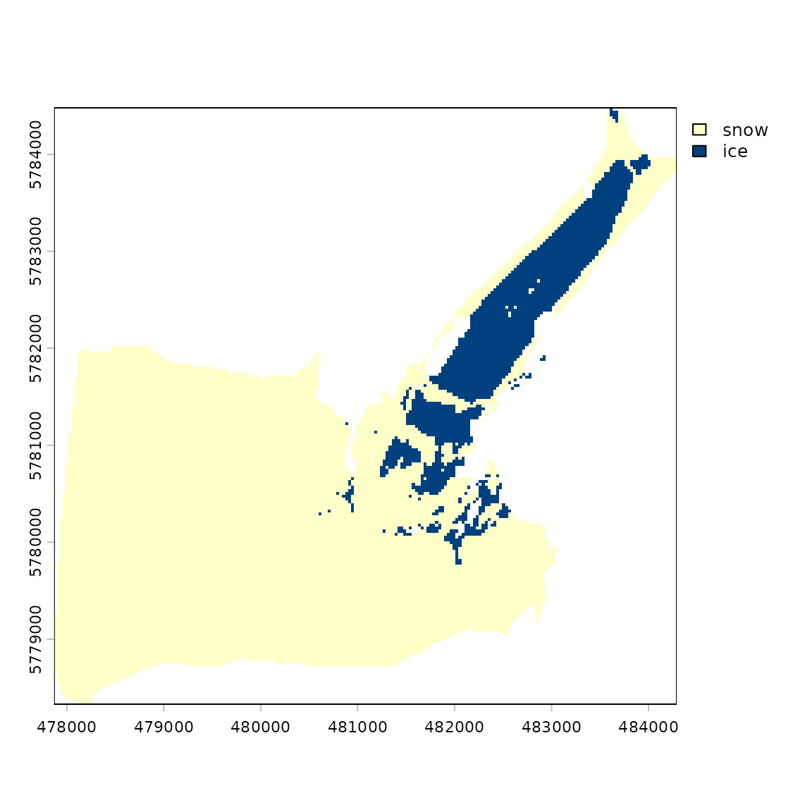
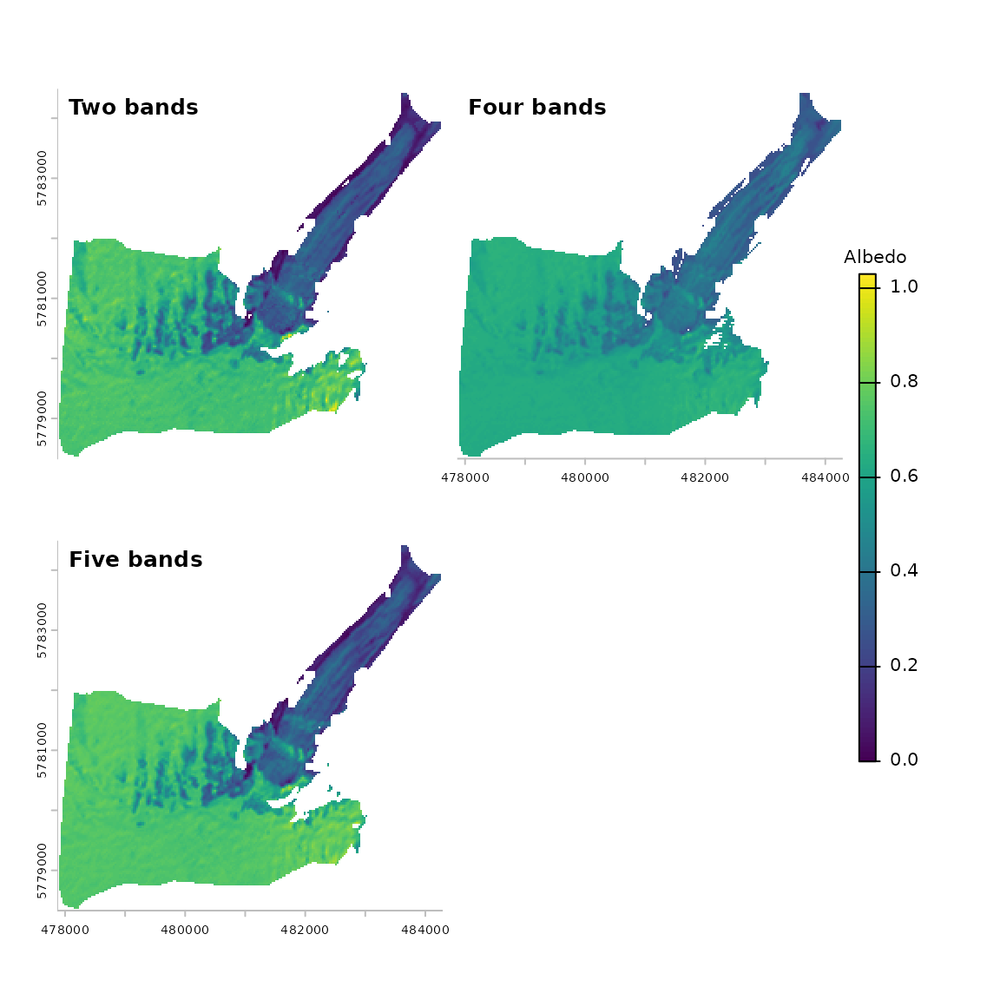

# Retrieving snow and ice albedo from Landsat data

This vignette shows how to use Landsat surface reflectance, topographic
data, and glacier outlines to retrieve snow and ice albedo at the
Athabasca Glacier in Canada. We provide the input datasets for 16 August
2020 and guide the user through the processing steps implemented in
`SatRbedo`. It is assumed that users have basic knowledge of geographic
information systems, satellite remote sensing, and accessing Earth
Observation data.

## Load the required packages

First, we load the `SatRbedo` and [terra](https://rspatial.org/)
packages. The latter is used for spatial data manipulation,
visualization, and analysis.

``` r
library(SatRbedo)
library(terra)
```

## Input data

Landsat surface reflectance (Landsat Collection 2 Level-2) and
topographic (e.g., SRTM) data for the area of interest can be downloaded
from the USGS [EarthExplorer](https://earthexplorer.usgs.gov/). Glacier
outlines are available on the [GLIMS](https://www.glims.org/) website.

The `SatRbedo` package provides functions to calculate albedo using two
(green and near-infrared), four (blue, green, red, and near-infrared),
and five (blue, red, near-infrared, shortwave-infrared 1, and
shortwave-infrared 2) spectral bands. These functions also require the
solar and view angles. To generate these angles, the [Landsat Angles
Creation
Tools](https://www.usgs.gov/landsat-missions/solar-illumination-and-sensor-viewing-angle-coefficient-files)
can be used.

After downloading the necessary input data, reproject the digital
elevation model (DEM) grid and the glacier outline shapefile to
Landsat’s coordinate system, then resample the DEM to 30 m spatial
resolution. Select scenes with minimal cloud coverage and crop the DEM,
surface reflectance, and angle bands to the area of interest. These
tasks can be performed using the
[`preproc()`](https://pabl1t0x.github.io/SatRbedo/reference/preproc.md)
function and the [terra](https://rspatial.org/) package.

Below, we provide the necessary input data to run the `SatRbedo`
functions for the area of interest:

``` r
# Load the Landsat surface reflectance bands
blue_SR <- system.file("extdata/athabasca_2020229_B02_L30.tif", package = "SatRbedo") # blue band surface reflectance (Landsat band 2)
green_SR <- system.file("extdata/athabasca_2020229_B03_L30.tif", package = "SatRbedo") # green band surface reflectance (Landsat band 3)
red_SR <- system.file("extdata/athabasca_2020229_B04_L30.tif", package = "SatRbedo") # red band surface reflectance (Landsat band 4)
NIR_SR <- system.file("extdata/athabasca_2020229_B05_L30.tif", package = "SatRbedo") # near-infrared band surface reflectance (Landsat band 5)
SWIR1_SR <- system.file("extdata/athabasca_2020229_B06_L30.tif", package = "SatRbedo") # shortwave-infrared band 1 surface reflectance (Landsat band 6)
SWIR2_SR <- system.file("extdata/athabasca_2020229_B07_L30.tif", package = "SatRbedo") # shortwave-infrared band 2 surface reflectance (Landsat band 7)

# Load the DEM and the glacier outline
dem <- system.file("extdata/athabasca_dem.tif", package = "SatRbedo")
outline <- system.file("extdata/athabasca_outline.shp", package = "SatRbedo")

# Transform the raster data to SpatRaster and the glacier outline to SpatVector
dem <- terra::rast(dem)
glacier_mask <- terra::vect(outline)
blue <- terra::rast(blue_SR)
green <- terra::rast(green_SR)
red <- terra::rast(red_SR)
nir <- terra::rast(NIR_SR)
swir1 <- terra::rast(SWIR1_SR)
swir2 <- terra::rast(SWIR2_SR)
```

## Topographic correction

The topographic correction compensates for differences in solar
illumination caused by elevation, slope, aspect, and the obstruction of
surrounding terrain. The topographic correction methods implemented in
`SatRbedo` require the removal of terrain shadow effects, including self
and cast shadows. This can be achieved with the
[`shadow_removal()`](https://pabl1t0x.github.io/SatRbedo/reference/shadow_removal.md)
function:

``` r
SAA <- 154.6 # solar azimuth angle
SZA <- 40.8 # solar zenith angle
msk <- shadow_removal(dem, SZA, SAA, mask = TRUE) # Shadow mask

# Remove shadowed pixels
blue_masked <- blue * msk
green_masked <- green * msk
red_masked <- red * msk
nir_masked <- nir * msk
swir1_masked <- swir1 * msk
swir2_masked <- swir2 * msk
```

Then, the topographic correction is carried out using the
[`topo_corr()`](https://pabl1t0x.github.io/SatRbedo/reference/topo_corr.md)
function:

``` r
# Topographic correction using method = "tanrotation"
blue_corr <- topo_corr(blue_masked, dem, SAA, SZA, method = "tanrotation")
green_corr <- topo_corr(green_masked, dem, SAA, SZA, method = "tanrotation")
red_corr <- topo_corr(red_masked, dem, SAA, SZA, method = "tanrotation")
nir_corr <- topo_corr(nir_masked, dem, SAA, SZA, method = "tanrotation")
swir1_corr <- topo_corr(swir1_masked, dem, SAA, SZA, method = "tanrotation")
swir2_corr <- topo_corr(swir2_masked, dem, SAA, SZA, method = "tanrotation")

# Topographic correction using method = "ccorrection"
blue_corr_c <- topo_corr(blue_masked, dem, SAA, SZA, method = "ccorrection", IC_min = 0.3)
green_corr_c <- topo_corr(green_masked, dem, SAA, SZA, method = "ccorrection", IC_min = 0.3)
red_corr_c <- topo_corr(red_masked, dem, SAA, SZA, method = "ccorrection", IC_min = 0.3)
nir_corr_c <- topo_corr(nir_masked, dem, SAA, SZA, method = "ccorrection", IC_min = 0.3)
swir1_corr_c <- topo_corr(swir1_masked, dem, SAA, SZA, method = "ccorrection", IC_min = 0.3)
swir2_corr_c <- topo_corr(swir2_masked, dem, SAA, SZA, method = "ccorrection", IC_min = 0.3)
```

The first method (method = “tanrotation”) is preferred because it does
not overcorrect surface reflectance in low-illumination regions.

## Discrimination of snow and ice pixels

The algorithm for distinguishing snow from ice surfaces uses the green
and near-infrared surface reflectance bands. It is applied to all pixels
within the glacier mask.

``` r
green_crop <- terra::crop(green, glacier_mask, mask = TRUE)
nir_crop <- terra::crop(nir, glacier_mask, mask = TRUE)
surf_type <- snow_or_ice(green_crop, nir_crop)
thres <- surf_type$th
plot(surf_type$NDSII > thres, type = "classes",
  col = c("#FFFFC8", "#00407F"), levels = c("snow", "ice"))
```



## Estimation of broadband albedo after anisotropic correction

Finally, broadband albedo can be calculated using three different
methods through the
[`albedo_sat()`](https://pabl1t0x.github.io/SatRbedo/reference/albedo_sat.md)
function.

``` r
SAA <- 154.6 # solar azimuth angle
SZA <- 40.8 # solar zenith angle
VAA <- 266.3 # view azimuth angle
VZA <- 4.1 # view zenith angle

# Use the glacier mask to crop the DEM and the topographically-corrected bands
dem_crop <- terra::crop(dem, glacier_mask, mask = TRUE)
slope <- terra::terrain(dem_crop, v = "slope", neighbors = 4, unit = "degrees")
aspect <- terra::terrain(dem_crop, v = "aspect", neighbors = 4, unit = "degrees")
blue_crop <- terra::crop(blue_corr$bands[[2]], glacier_mask, mask = TRUE)
green_crop <- terra::crop(green_corr$bands[[2]], glacier_mask, mask = TRUE)
red_crop <- terra::crop(red_corr$bands[[2]], glacier_mask, mask = TRUE)
nir_crop <- terra::crop(nir_corr$bands[[2]], glacier_mask, mask = TRUE)
swir1_crop <- terra::crop(swir1_corr$bands[[2]], glacier_mask, mask = TRUE)
swir2_crop <- terra::crop(swir2_corr$bands[[2]], glacier_mask, mask = TRUE)

albedo_two <- albedo_sat(
  SAA, SZA, VAA, VZA,
  slope, aspect, method = "twobands",
  green = green_crop, NIR = nir_crop, th = thres
)

albedo_four <- albedo_sat(
  method = "fourbands",
  blue = blue_crop, green = green_crop, red = red_crop, NIR = nir_crop
)

albedo_five <- albedo_sat(
  SAA, SZA, VAA, VZA,
  slope, aspect, method = "fivebands",
  blue = blue_crop, green = green_crop, red = red_crop,
  NIR = nir_crop, SWIR1 = swir1_crop, SWIR2 = swir2_crop, th = thres
)

# Plot the results
albedo <- c(albedo_two[[3]], albedo_four[[5]], albedo_five[[6]])
names(albedo) <- c("Two bands", "Four bands", "Five bands")
panel(albedo, plg = list(title = "Albedo"))
```


