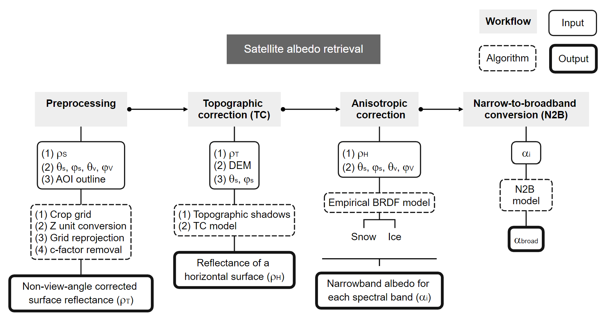

# Summary

Albedo is a key variable determining the amount of solar radiation absorbed by
snow and ice surfaces. As such, it influences meltwater production, glacier mass
balance, and the energy exchange between the Earth and the atmosphere [@jonsell_spatial_2003;@hock_glacier_2005]. Satellite remote sensing has been widely recognized as the best practical
approach for monitoring and mapping surface albedo across different spatial and temporal scales [@lin_estimating_2022;@urraca_assessing_2023]. Here, we present the `SatRbedo` R package:
an extensible, standalone toolbox for retrieving snow and ice albedo from medium-resolution multispectral optical satellite imagery. The package includes functions for image preprocessing, converting nadir satellite observations to off-nadir values using view-angle corrections, detecting topographic shadows, discriminating snow and ice surfaces, correcting for topographic effects and the anisotropic behavior of radiation reflected by glacier snow and ice, and converting narrowband to broadband albedo. The package has a modular structure that allows for changing the implemented routines and provides output that can be used independently or as input to other functions. `SatRbedo` is optimized for Landsat and Sentinel-2 data but can also process data from other medium-resolution sensors (e.g., ALOS/AVNIR-2, SPOT, and ASTER), provided they meet the required input data specifications. For example, if at-sensor radiance data is available, atmospheric correction is required before using the package. Additionally, cross-sensor calibration should be performed to minimize spectral differences between sensors.

# Statement of need

The land surface albedo is an essential climate variable that controls the partitioning of radiative energy between the surface and the atmosphere [@bojinski_concept_2014;@radeloff_need_2024]. In the cryosphere, albedo ranges from <0.1 for debris-covered ice to 0.3-0.4 for bare ice to ~0.5 for aged, wet snow to >0.9 for fresh, dry snow [@cuffey_physics_2010]. Snow and ice albedo depend on the inherent optical properties of the surface (including snow grain size and shape, snowpack thickness, surface roughness, and water and impurity content) and are also influenced by environmental conditions (apparent albedo), including the angular and spectral distribution of solar radiation, topography, the underlying substrate for thin snow cover, and cloud cover [@warren_optical_2019;@whicker_snicar-adv4_2022].

Albedo can be measured in the field using observations from a pyranometer pair, one looking upward and the other looking downward [@driemel_baseline_2018;@picard_spectral_2020]. Although these instruments provide highly accurate point measurements, they have limited spatial coverage due to their relatively small footprint. Alternatively, albedo can be estimated from satellite remote sensing [@bertoncini_large-area_2022;@fugazza_spatial_2016], which offers the best option for studying albedo changes, considering its high spatial and temporal variability [@berg_finescale_2020].

Satellite albedo retrievals typically comprise three steps: atmospheric correction, modeling of the angular reflectance, and narrow-to-broadband albedo conversion [@carlsen_parameterizing_2020;@qu_mapping_2015]. The algorithms for atmospheric correction [@doxani_atmospheric_2023;@vermote_preliminary_2016], angular reflectance modelling [@klok_temporal_2003;@lucht_algorithm_2000;@ren_anisotropy_2021], and narrow-to-broadband albedo conversion
[@knap_narrowband_1999;@li_preliminary_2018;@liang_narrowband_2001] are well established and validated across a number of case studies. In addition to these steps, satellite image preprocessing and topographic correction are necessary to homogenize the input data and minimize the effects of slope and aspect on albedo, respectively.

Although many useful workflows are available for retrieving snow and ice albedo [@bertoncini_large-area_2022;@feng_remote_2023;@mullen_operational_2022;@ren_observed_2024], these workflows are often designed for specific case studies, have limited modularity and documentation, and lack function testing. This restricts their applicability in other regions and their long-term maintainability. `SatRbedo` addresses these limitations by providing an open-source, extensible, and well-documented R package for estimating snow and ice albedo from medium-resolution satellite data.

# Implementation

`SatRbedo` consists of four workflows that run in a processing pipeline (\autoref{fig:workflow}).

{ width=80% }

* Firstly, the Preprocessing Workflow requires application-ready surface reflectance data for all available spectral bands ($\rho_s$), satellite ($\varphi_v$, $\theta_v$) and solar ($\varphi_s$, $\theta_s$) azimuth and zenith angles, and an outline of the area of interest (AOI) to carry out the following preprocessing steps: crop the satellite grids to a specified extent; convert data from integer to floating point; re-project grids to a common coordinate system; and convert nadir satellite observations to off-nadir values using view-angle corrections based on the c-factor method [@roy_general_2016].

* Subsequently, in the Topographic Correction Workflow, surface reflectance that is not adjusted for view angle ($\rho_T$) is corrected for topographic effects to generate equivalent reflectance values over flat terrain ($\rho_H$). `SatRbedo` provides two empirical methods: the rotation model by @tan_improved_2013 and the C-correction model [@teillet_slope-aspect_1982]. These algorithms are appropriate for mountainous environments with rugged topography and non-Lambertian surface properties, requiring a digital elevation model (DEM) and solar azimuth and zenith angles as inputs. Both models assume a linear relationship between reflectance and the solar incidence angle on an inclined surface. Additional functions are available to remove topographic shadows (both self- and cast) using the vectorial algebra algorithms introduced by @corripio_vectorial_2003.

* The Anisotropic Correction Workflow corrects for the anisotropic reflection properties of snow and ice. For each surface type, the anisotropic reflection factors ($f$) are calculated using empirical Bidirectional Reflectance Distribution Function (BRDF) models that consider the view-solar geometry relative to the inclined surface, described by slope and aspect. `SatRbedo` includes two models: the BRDF models of @koks_anisotropic_2001 for snow and @greuell_anisotropic_1999 for ice, both used with green and near-infrared (NIR) bands, and parameterizations from @ren_anisotropy_2021 for combinations of blue, red, NIR, and shortwave-infrared bands. To distinguish snow from ice, the Normalized Difference Snow/Ice Index
[NDSII,@keshri_aster_2009] is computed from green ($\rho_{T, green}$) and NIR ($\rho_{T, NIR}$) surface reflectance, and surface discrimination is performed using an automatic threshold selection based on the Otsu algorithm [@otsu_threshold_1979].

* The Narrow-to-broadband albedo conversion Workflow employs empirical BRDF models to compute narrowband albedo ($\alpha_{narrowband}$) for each spectral band after topographic correction ($\rho_H$). It then derives broadband albedo ($\alpha_{broadband}$) from these narrowband values using the empirical relationships proposed by @knap_narrowband_1999 and @liang_narrowband_2001. Furthermore, a function is included that implements a direct approach that does not require an anisotropy correction and transforms surface reflectance into albedo using the algorithm from @feng_remote_2023.

# Future development

It is expected that active development on `SatRbedo` will continue in the future through the incorporation of the newest tools and methods as they become available, as well as through the active participation of the research community through the software repository platform. Developments in progress include a kernel-based semiempirical BRDF model and new snow and snow-free narrow-to-broadband albedo conversion algorithms.

# Acknowledgements

This research was supported by a University of Canterbury Doctoral Scholarship. The authors wish to acknowledge using the `terra` package [@hijmans_terra_2025] that provided the raster data handling infrastructure on which `SatRbedo` was built. We also thank Javier Corripio, who wrote the original vectorial algebra algorithms for computing topographic shading on complex terrain.

# References